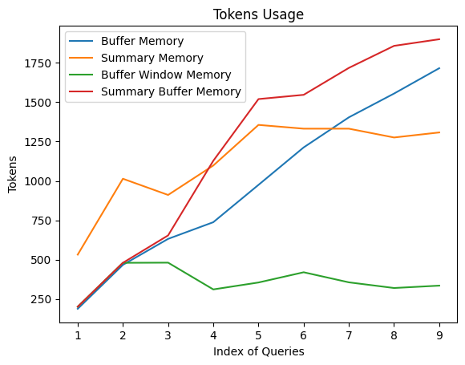

# WTF Langchain极简入门: 07. 记忆组件

最近在学习Langchain框架，顺手写一个“WTF Langchain极简入门”，供小白们使用（编程大佬可以另找教程）。本教程默认以下前提：
- 使用Python版本的[Langchain](https://github.com/hwchase17/langchain)
- LLM使用OpenAI的模型
- Langchain目前还处于快速发展阶段，版本迭代频繁，为避免示例代码失效，本教程统一使用版本 **0.0.235**

根据Langchain的[代码约定](https://github.com/hwchase17/langchain/blob/v0.0.235/pyproject.toml#L14C1-L14C24)，Python版本 ">=3.8.1,<4.0"。

推特：[@verysmallwoods](https://twitter.com/verysmallwoods)

所有代码和教程开源在github: [github.com/sugarforever/wtf-langchain](https://github.com/sugarforever/wtf-langchain)

-----

## 简介

大多数LLM应用都具有对话界面。对话的一个重要组成部分是对话历史中的信息。我们将这种存储对话历史中的信息的能力称为"记忆"。`LangChain` 提供了一系列记忆相关的实用工具。这些工具可以单独使用，也可以无缝地集成到一条链中。

记忆组件需要支持
- 读取
- 写入

注，每条链定义了核心执行逻辑，期望某些输入。一些输入来自用户，另一些可能来自记忆组件。在一次与LLM的交互中，链将与记忆组件交互两次：
1. 接收到初始用户输入之后，执行核心逻辑之前，链从记忆组件读取历史，并以此增强用户输入。
2. 执行核心逻辑之后，在返回回答之前，链把当前交互的输入和输出写入到记忆中，以便更新对话历史。

## LangChain的记忆组件类型

记忆组件需要解决两大问题：
1. 历史如何存储？
2. 历史如何查询？

本讲通过 `LangChain` 提供的三种基本记忆组件类型 `ConversationBufferMemory`，`ConversationBufferWindowMemory`，`ConversationSummaryMemory`，介绍它们对于上述问题的解决方案，并分享使用方法。

### ConversationBufferMemory

`ConversationBufferMemory` 是 `LangChain` 提供的记忆组件类， 它如实地在列表中记录对话历史消息。

#### 写入一次对话

通过 `save_context` 函数来保存用户输入和模型输出。

```python
from langchain.memory import ConversationBufferMemory
memory = ConversationBufferMemory()
memory.save_context({"input": "Hi, LangChain!"}, {"output": "Hey!"})
```

`ConversationBufferMemory` 的 `chat_memory` 成员变量有一个 `messages` 变量。这是一个消息数组。通过如下代码查看消息对象列表

```python
memory.chat_memory.messages
```

你应该期望看到如下输出：

```shell
[HumanMessage(content='Hi, LangChain!', additional_kwargs={}, example=False),
 AIMessage(content='Hey!', additional_kwargs={}, example=False)]
```

当我们需要生成对话历史的文本，作为变量嵌入提示词，可以通过调用函数 `load_memory_variables` 获得字典对象，其中的键 `history` 包含了对话历史的字符串值。如下：

```python
memory.load_memory_variables({})
```

你应该期望看到如下输出：

```shell
{'history': 'Human: Hi, LangChain!\nAI: Hey!'}
```

`ConversationBufferMemory` 的实现方式简单，在交互次数少，输入输出字符量不大的情况下，非常有效。但是当交互增加，字符数量增多，对话历史的字符数可能导致增强后的提示词tokens数超过上下文限制，最终导致模型调用失败。因此，`LangChain` 还提供了其他记忆组件类型。

### ConversationBufferWindowMemory

`ConversationBufferWindowMemory` 持续记录对话历史，但只使用最近的K个交互。这种滑动窗口的机制，确保缓存大小不会变得过大。

用法如下：

我们指定滑动窗口的大小为1，表示查询时只返回最近1次交互。

```python
memory = ConversationBufferWindowMemory( k=1)
memory.save_context({"input": "Hi, LangChain!"}, {"output": "Hey!"})
memory.save_context({"input": "Where are you?"}, {"output": "By your side"})
```

通过 `load_memory_variables` 读取记忆

```python
memory.load_memory_variables({})
```

你应该期望看到如下输出：

```shell
{'history': 'Human: Where are you?\nAI: By your side'}
```

我们看看记忆组件中存储的历史交互：

```python
memory.chat_memory.messages
```

输出：

```shell
[HumanMessage(content='Hi, LangChain!', additional_kwargs={}, example=False),
 AIMessage(content='Hey!', additional_kwargs={}, example=False),
 HumanMessage(content='Where are you?', additional_kwargs={}, example=False),
 AIMessage(content='By your side', additional_kwargs={}, example=False)]
```

可见，组件记忆了所有交互，但是在查询时通过滑动窗口返回指定数量的交互（输入与输出）。

### ConversationSummaryMemory

`ConversationSummaryMemory` 是稍微复杂的记忆类型。这种记忆随着时间的推移总结对话的内容，并将当前的摘要存储在记忆中，然后在需要的时候将对话摘要注入提示词或链中。`ConversationSummaryMemory` 对于更长的对话交互很有用，因为将过去的历史记录逐字逐句放入提示词中会占用太多Token。

注意，由于需要对于对话历史进行总结，生成摘要，因此 `ConversationSummaryMemory` 需要LLM的配合。我们在示例代码中将提供OpenAI的模型给 `ConversationSummaryMemory` 以生成摘要。

用法如下：

```python
from langchain.memory import ConversationSummaryMemory
from langchain.llms import OpenAI

memory = ConversationSummaryMemory(llm=OpenAI(temperature=0, openai_api_key="您的有效openai api key"))
memory.save_context({"input": "Hi, LangChain!"}, {"output": "Hey!"})
memory.save_context({"input": "How to start with Next.js development?"}, {"output": "You can get started with its official developer guide."})
memory.save_context({"input": "Show me the link of the guide."}, {"output": "I'm looking for you now. Please stand by!"})

memory.load_memory_variables({})
```

你应该能看到如下输出：

```shell
{'history': '\nThe human greets the AI, LangChain, to which the AI responds with a friendly "Hey!" The human then asks how to start with Next.js development, to which the AI responds with instructions to use the official developer guide, and provides a link when asked.'}
```

你可能注意到了，从记忆组件中得到的对话历史的文本，相较于原始的对话文字，并没有显著地缩短。原因在于对话的交互只有3次，在这种情况下，摘要的优势并没有显示出来。

下图是不同记忆类型组件随着对话交互的增加，生成的对话历史信息的Token开销趋势。
可见，`ConversationSummaryMemory` 的Token开销相对平缓，这对于交互多的对话是更有效的。



图中，还展示了我们并没有介绍的类型 `Summary Buffer Memory`。顾名思义，这是结合了 `Summary` 和 `Buffer` 的优势的一种记忆类型。

## 总结
本节课程中，我们学习了什么是 `记忆组件` ，并通过三种基本记忆组件类型 `ConversationBufferMemory`，`ConversationBufferWindowMemory`，`ConversationSummaryMemory`，介绍它们的工作原理和使用方法。本课只介绍了 `LangChain` 提供的部分记忆组件，更多类型请参考官方文档 [Memory Types](https://python.langchain.com/docs/modules/memory/types/)。

### 相关文档资料链接：
1. [Python Langchain官方文档](https://python.langchain.com/docs/get_started/introduction.html) 
2. [记忆组件](https://python.langchain.com/docs/modules/memory/)